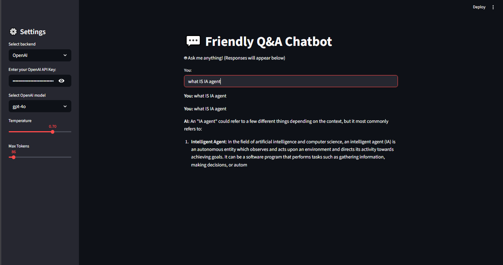
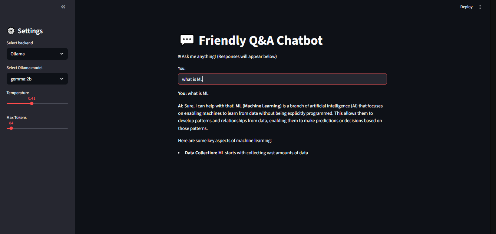

# 💬 Friendly Q&A Chatbot (Ollama + OpenAI)

## Introduction
Welcome to the **Friendly Q&A Chatbot**, a versatile AI-powered chatbot built using **LangChain**, **Ollama**, and **OpenAI**.  
This application allows users to interact with AI models either **locally** through Ollama or **via OpenAI API**, providing a **friendly, conversational experience** with customizable settings for temperature, response length, and model selection.  

**Preview of the Application:**

- *When using OpenAI models:*  
    
  *Screenshot showing the chatbot running with OpenAI (e.g., GPT-4o).*  

- *When using Ollama models:*  
    
  *Screenshot showing the chatbot running with Ollama (e.g., Llama2 or Gemma).*  

---

## Problem Statement
Many users need a conversational assistant to answer questions, summarize information, or provide guidance. Traditional cloud-based AI chatbots may expose sensitive data or require constant internet access.  

This project addresses these challenges by providing:

- **Local AI inference** via Ollama for privacy and offline usage.
- **Cloud AI access** via OpenAI for high-quality responses.
- **Interactive and friendly chat interface**.

**Illustration of the problem:**  
  
*Example showing how the chatbot helps users get answers safely and efficiently.*

---

## Features
- Chat with **OpenAI models** (`gpt-4o`, `gpt-4-turbo`, `gpt-4`, `gpt-3.5-turbo`)  
- Chat with **local Ollama models** (`llama2:latest`, `gemma:2b`)  
- Friendly, chat-like interface with **conversation history**  
- Adjustable **temperature** and **response length**  
- **Combined interface** to switch between OpenAI and Ollama  
- Easy integration of **new AI models**  

---

## Configuration Parameters
The chatbot includes customizable parameters to control how responses are generated:

### 🔥 Temperature
- **What it does:** Controls how *creative or deterministic* the responses are.  
- **Range:** `0.0` → `2.0`  
  - `0.0` = very focused, repetitive, deterministic answers.  
  - `1.0` = balanced creativity.  
  - `2.0` = highly random and imaginative responses.  
- **Example:**  
  - *Temperature 0.2:* “The capital of France is Paris.”  
  - *Temperature 1.2:* “Paris is the capital, but you might also love its culture, food, and art!”  

### 📏 Max Tokens
- **What it does:** Defines the **maximum length of the model’s response** (in tokens, not characters).  
- **Range:** Depends on the model (e.g., GPT-4o supports up to ~128k tokens).  
- **Why it matters:**  
  - Higher values allow **longer, more detailed answers**.  
  - Lower values enforce **short, concise answers**.  
- **Example:**  
  - *max_tokens = 50* → “Paris is the capital of France.”  
  - *max_tokens = 500* → Detailed answer with history, culture, and extra context about Paris.  

---

## Technologies Used
- **Python 3.10+**  
- **Streamlit** – interactive web interface  
- **LangChain** – orchestrating AI prompts and chains  
- **Ollama** – local AI inference  
- **OpenAI API** – cloud AI inference  
- **Markdown & Session State** – for chat formatting  

---

## Project Structure
